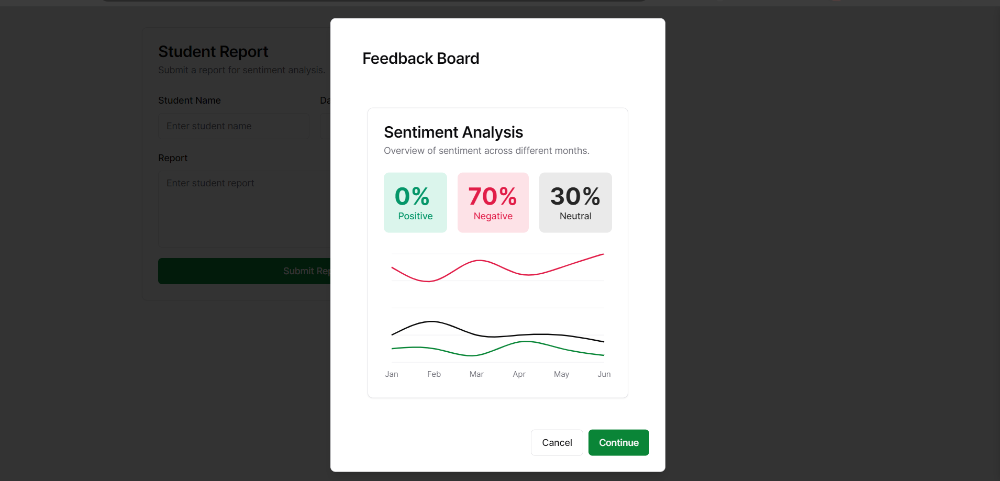

# Behavior Monitoring System

## About the Project

The Behavior Monitoring System (BMS) is a sophisticated AI-driven solution designed to analyze and monitor student behavior through sentiment analysis of submitted reports. Leveraging advanced machine learning models, this system provides feedback on the sentiment of each report and assesses the risk of the student's behavior. The BMS aims to support educators and administrators in understanding and addressing student needs more effectively.

### Key Features

- **Sentiment Analysis:** Utilizes cutting-edge AI models to analyze the sentiment of submitted reports, identifying positive, negative, and neutral tones.
- **Behavior Risk Assessment:** Assesses the risk associated with a student's behavior based on sentiment analysis, offering valuable insights for intervention and support.
- **Historical Data Simulation:** Simulates feedback for the past 6 months to provide a comprehensive analysis of behavioral trends.
- **Real-Time Feedback:** Provides immediate and actionable feedback based on the analysis of the input data.

### How It Works

The core functionality of the BMS is powered by an AI model from Google, specifically designed for sentiment analysis and behavior monitoring. The system processes submitted reports, extracts key details, and performs sentiment analysis to determine the overall sentiment and risk level associated with the behavior described in the report.




This is a [Next.js](https://nextjs.org/) project bootstrapped with [`create-next-app`](https://github.com/vercel/next.js/tree/canary/packages/create-next-app).

## Getting Started

First, run the development server:

```bash
npm run dev
# or
yarn dev
# or
pnpm dev
# or
bun dev
```

Open [http://localhost:3000](http://localhost:3000) with your browser to see the result.

You can start editing the page by modifying `app/page.tsx`. The page auto-updates as you edit the file.

This project uses [`next/font`](https://nextjs.org/docs/basic-features/font-optimization) to automatically optimize and load Inter, a custom Google Font.

## Learn More

To learn more about Next.js, take a look at the following resources:

- [Next.js Documentation](https://nextjs.org/docs) - learn about Next.js features and API.
- [Learn Next.js](https://nextjs.org/learn) - an interactive Next.js tutorial.

You can check out [the Next.js GitHub repository](https://github.com/vercel/next.js/) - your feedback and contributions are welcome!

## Live Demo

Checkout live demo on Vercel [Behavior Monitoring System](https://behavior-monitory-system.vercel.app) 
